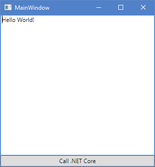

# netcore-UI-samples
A collection of simple sample applications for various UI frameworks that consume a shared .NET Core library.

## Overview

|    Project    |    NetCore    |   Full .Net   |legacy project*| Memory consumption 64bit | "32bit |
| --- | :-: | :-: | :-: | --: | --: |
| NetCoreLibrary | X | | | |
| Console | X | | | 2,6 MB | 2,6 MB |
| WPF_cs | | X | | 15,8 MB | 11,8 MB |
| WPF_xaml | | X | X | 16,5 MB | 13,2 MB
| Windows Forms | | X | X | 4,5 MB | 4,9 MB |
| DevZH.UI | X | | | 3,5 MB | 3,6 MB |
| GTKSharp | | X | X | 10,4 MB | - |
| AspNetCore | X | | | - | - |

*\* legacy project: does not use the new .csproj format*

## Details

### Console
Plain console application targetting .NET Core.

### WPF_cs
A WPF application using the new csproj format, targetting the full .NET Framework (Windows specific).
This version only uses C# code to initialize all UI controls.

### WPF_xaml
A WPF application using the default VisualStudip template for WPF.
Requires the older, bigger csproj project, uses XAML.

### Windows Forms
A legacy Windows Forms application using the VisualStudio designer.

### DevZH.UI
https://github.com/noliar/DevZH.UI

A simple binding (Experimental!!!) using .NET Core for https://github.com/andlabs/libui, which is
an awesome native UI library for Unix, OSX and Windows 

### GtkSharp

http://www.mono-project.com/docs/gui/gtksharp/
The project binds the gtk+ toolkit and assorted GNOME libraries, enabling fully
native graphical Gnome application development using the Mono and .Net development frameworks.

Requires GTK+ to be installed on the machine, instructions here:
https://www.gtk.org/download/windows.php

### AspNetCore

This just launches a web server and uses a javascript callback.
It's not exactly a UI framework, it requires a web browser to run.

## Additional frameworks to explore

### Avalonia

https://github.com/AvaloniaUI/Avalonia

Supposed to work with .NET Core, but I wasn't able to get it running, yet. 
It seems the Avalonia base nuget package requires Xamarin.Android and the
Java SDK to be installed.

### Xamarin Forms

Even the "Getting started" projects are huge, see:
https://github.com/xamarin/xamarin-forms-samples/tree/master/GettingStarted/XamarinFormsSample/XamarinFormsSample
There is no "Net Core" app runtime available at this point, you can consume .NET Standard libraries, but the end
application will run on Mono or full .NET, using UWP or WinRT, or one of the Xamarin Platforms (e.g. Xamarin.Android)

### QTSharp

https://github.com/ddobrev/QtSharp
.NET Bindings for the well known cross platform UI library QT.
Requires full .NET Framework or Mono, Requires QT to be installed on the machine.

